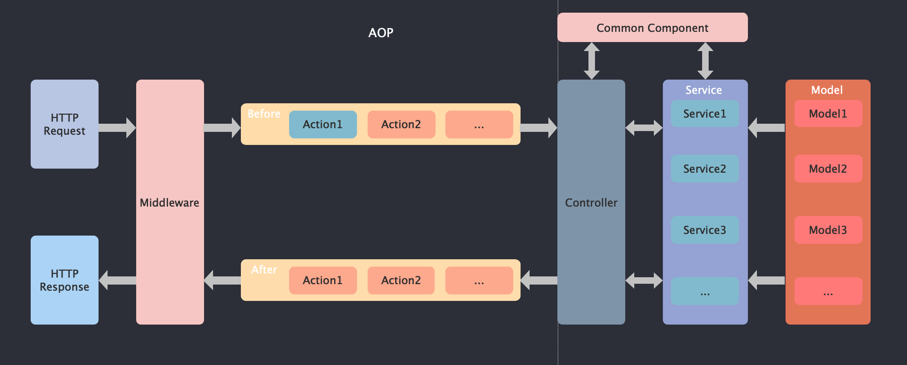

# kever   

**A lightweight inversion of control nodejs framework based on TypeScript.**

<div align=center>
  
</div>


## Quick Start

### Web Application


### Install

```bash
npm insatll -g @kever/cli
```

### Create Project

```bash
kever init
```
